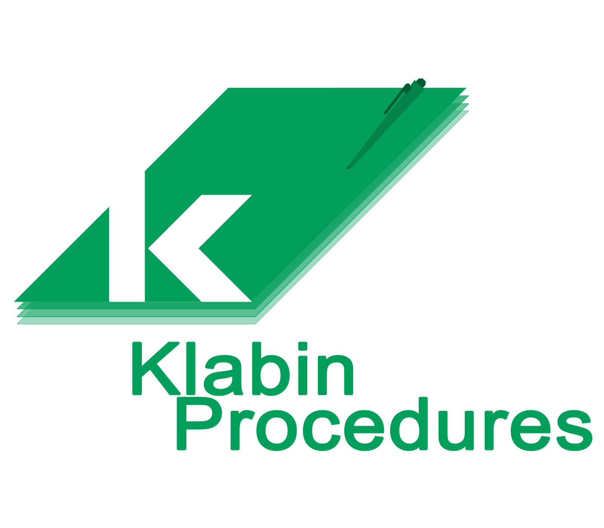

  

<h3 align="center">
  Projeto para cadastramento de procedimentos de bloqueio de máquinas industriais.
</h3>
    
 

##### Autores: José Octávio Conti de Sousa & Milton Boos Junior

#### Sobre o projeto
Aplicativo piloto feito para a produtora e exportadora de papéis Klabin para automatizar o cadastramento de bloqueios de máquinas para ser feita sua manutenção

- Aplicativo desenvolvido através do ionic framework 
- Este será portável para as plataformas Android e IOS

### Tecnologias utilizadas:
- Ionic 4
- Angular 7
- Cordova 9
